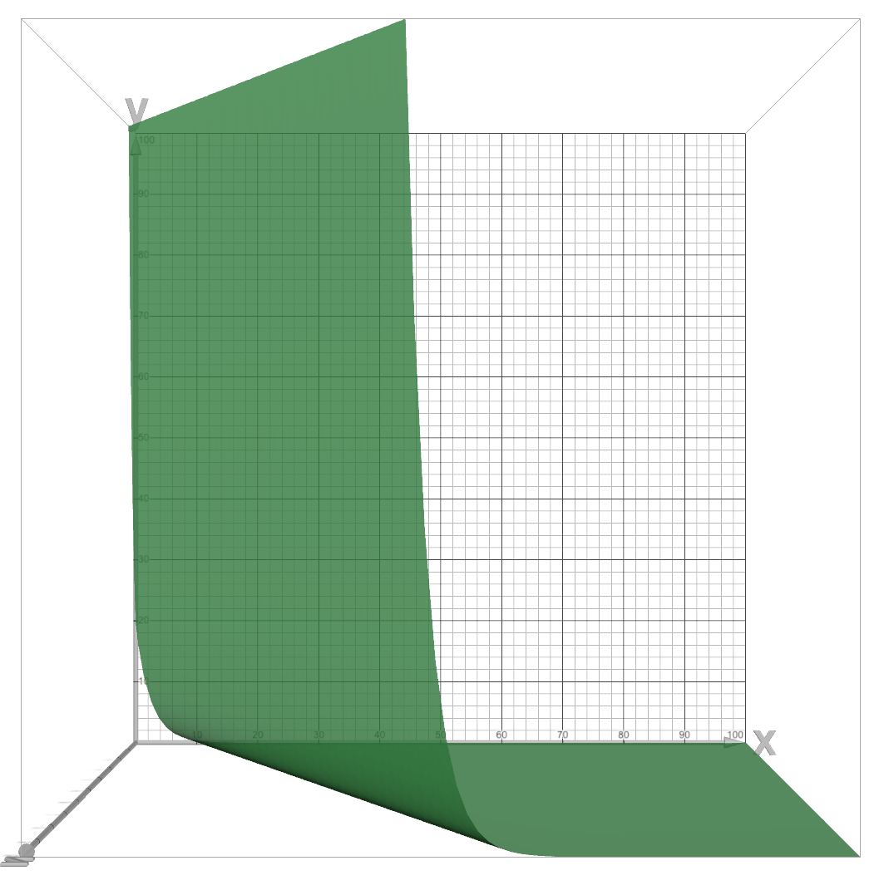
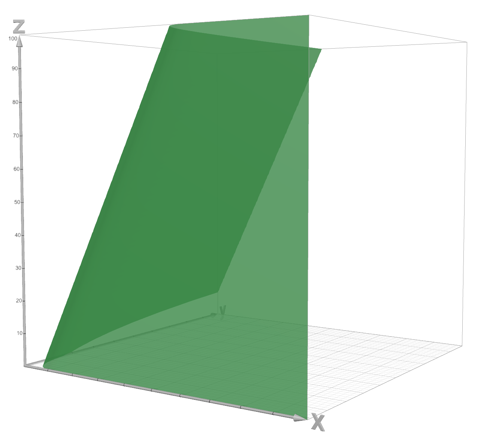

# Portimao

## Programming your car

In your lua script, you need to create a `takeYourTurn` function. In this function you will program your car's behavior.
You have at your disposal a `GameState` object (its actually a (hash)table, everything in lua is a table), which has the following properties:

- `turns` - the number of turns that have passed
- `cars` - List of all cars in the game. Each car has the following properties:
  - `balance` - the amount of money the car has
  - `speed` - the speed of the car
  - `y` - the y position of the car
- `bananas` - List of the y position of all bananas in the game.
- `index` - your car's index in the cars list
- `buy_acceleration(amount)` - function to buy acceleration.
- `buy_banana()` - function to buy banana.
- `buy_shell(amount)` - function to buy shell.
- `get_acceleration_cost(amount)` - function to get acceleration cost.
- `get_banana_cost()` - function to get banana cost.
- `get_shell_cost(amount)` - function to get shell cost.

## Price function

$`\text{action\_price} = \text{targetPrice} \times e^{\left(\ln(1 - \text{perTurnPriceDecrease}) \cdot \left((\text{turnsSinceStart} - 1) - \frac{\text{sold} + 1}{\text{sellPerTurn}}\right)\right)}`$

Where `targetPrice` is the price you want to reach, `perTurnPriceDecrease` is the percentage of price decrease per turn, `turnsSinceStart` is the number of turns since the game started, `sold` is the number of items sold, and `sellPerTurn` is the number of items you want to sell per turn.

You can assume that the target price, per turn price decrease, and sell per turn have constant value throughout the game for each action.

So the only variables that change are the `turnsSinceStart` and `sold`.

We have the following graphs where the x is the `turnsSinceStart`, z is the `sold` and the y is the `actionPrice`.

when you buy multiple items in the same turn, the price is calculated as if you bought them one by one. So the actual price you pay is the sum of the prices of each item with new amount of items e.
